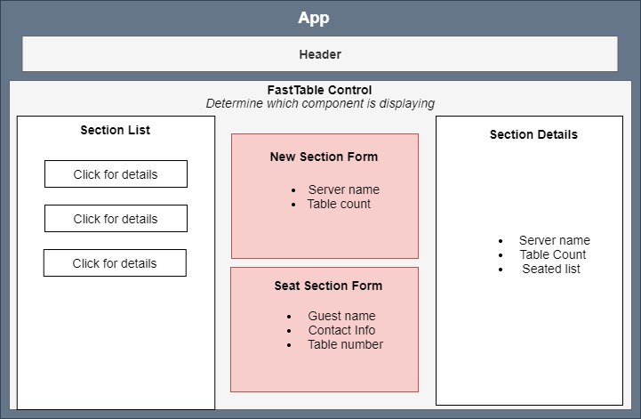

# FastTable
#### Created By: Connor Burgess 
* * *

## Description  
FastTable is a web application with full CRUD that allows restaurant operations and front desk to manage walk-in guests with speed and ease. Functionality includes tracking number of tables remaining in a server's section, section details, and quickly seating guests.
* * *

## User Stories
* As a user, I want to see a list/menu of all available server sections. For each section, I want to see its currently seated tables and their table numbers.
* As a user, I want to submit a form to add a new section to the list.
* As a user, I want to be able to click on a section to see its detail page.
* As a user, I want to see how many tables are left in a section.
* As a user, I want to be able to click a button next to a section to seat a guest.

## Technologies used
* React
* JavaScript
* Jest
* Enzyme
* HTML
* CSS
* npm
* Create React App

* * *
## Setup
* Clone Repo from GitHub (Link: https://github.com/ConnorBurgess/fast-table.git)
* Open in terminal or IDE/text editor of choice
* Ensure terminal is in fast-table directory and type `npm start` to load local server
* Local server should open automatically in browser but otherwise navigate to http://localhost:3000/ (default port) in browser URL
* Run unit tests by navigating to fast-table/src and type `npm test`

## To Do:
* 
## Resources Used:

## Additional comments:
* Created on 4/23/21  
* * *

## License:
> *&copy; Connor Burgess, 2021*

Licensed under [MIT license](https://mit-license.org/)

* * *

## Contact Information
_Connor Burgess: [Email](connorburgesscodes@gmail.com)_